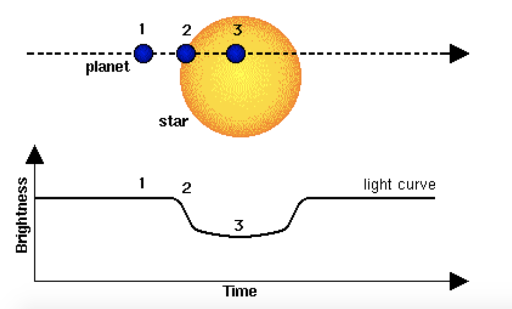
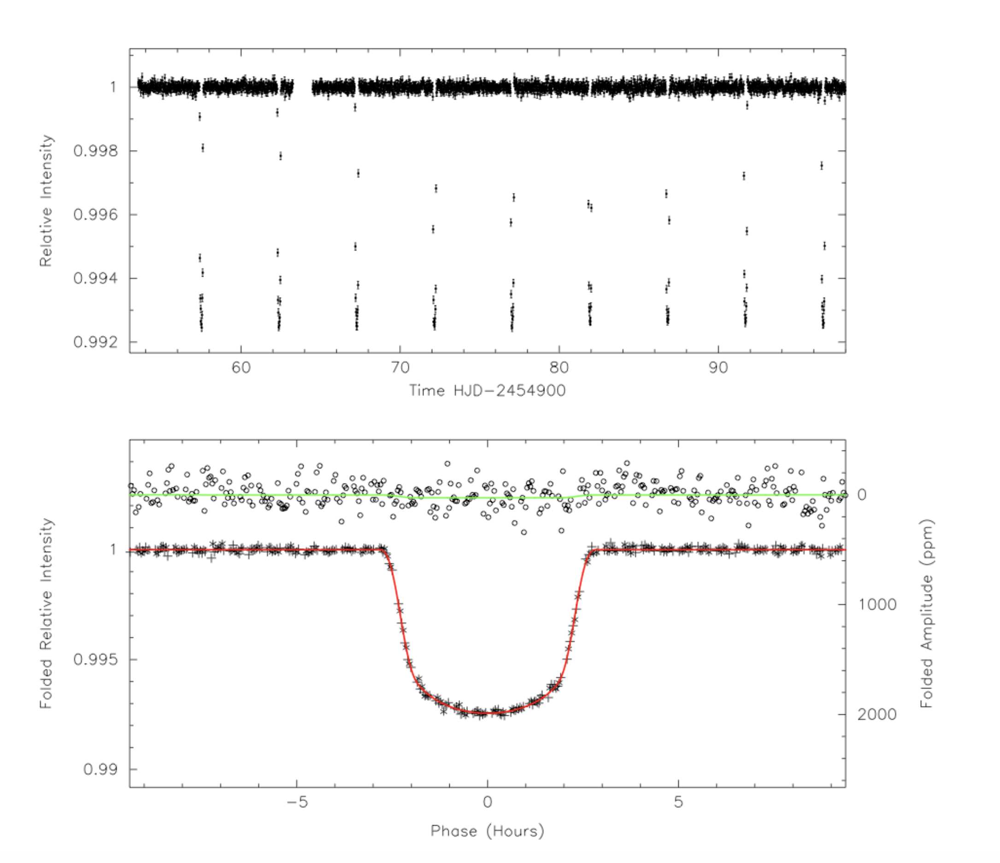

# Planet Hunting with Python

## Outline
NASA’s Kepler spacecraft was launched in 2009 and spent approximately 4 years staring at 150,000 stars, searching for planets orbiting around them using the transit detection method. The mission resulted in the discovery of 4717 exoplanet candidates, of which 2303 have been confirmed as bona fide planets, and a number of which are found to reside in multi-planet systems. More recently, NASA’s TESS planet hunting mission was launched and is now taking data. 

During your research, you will learn to write computer programmes in the Python programming language, and you will use your newly developed skills to write routines to analyse data from the Kepler and TESS missions using simplified algorithms. You will analyse light curves that have been downloaded from the Kepler and TESS spacecraft, and determine the key physical parameters of the planetary systems including orbital periods, orbital inclinations to the line of sight, orbital semi-major axes (i.e. the distance between the star and the planet), and the physical radii of the planets. You will have the opportunity to learn about fitting models to data, and techniques for optimising the accuracy of these models. Based on your analysis, you will be able to draw conclusions about the observed population of exoplanets, including whether or not they look like the planets in our Solar Systems. If you want to be really adventurous then you will be able take your research further, and explore more complex issues such as how dynamical interactions between planets in multi-planet systems can be detected in the data.

## Introduction
The first extrasolar planet discovered orbiting a Sun-like star was 51 Pegasi b (Mayor & Queloz 1995), and this discovery led to Michel Mayor and Didier Queloz being awarded the Nobel Prize for Physics in 2019. During the years since this ground-breaking discovery, the total number of confirmed extrasolar planets has increased to more than 5000 with new discoveries being made on an almost daily basis. We now know that the population of exoplanets in our Galaxy is very diverse, and that our Solar System does not provide an example of the most typical architecture.

The launch of the Kepler spacecraft in March 2009 heralded a dramatic improvement in our knowledge about exoplanets (Borucki et al 2010). Kepler was launched into an Earth-trailing heliocentric orbit, which allowed it to stare
continuously at one region of the sky for a period of approximately 4 years. The mission used the transit detection technique to find planets. This method looks for the periodic dimming of the light from a star as seen by an observer when a planet passes in front of the star during its orbit (see the figure above). For geometrical reasons, most planetary orbits around distant stars do not cause the planet to pass in front of the star when observed by the Kepler spacecraft. For a randomly orientated orbit the probability of observing a transit is typically about 1%, so for this reason the Kepler spacecraft monitored the brightness of approximately 150,000 stars for the duration of the mission, resulting in the discovery of approximately 4800 planet candidates, of which about 2500 have been confirmed to be genuine exoplanets. Note that there are numerous ways in which different astrophysical phenomena can mimic a transiting planet, hence the need for additional observations that are able to confirm the planetary nature of the Kepler planet candidate systems.

The Kepler spacecraft produced data in the form of light curves for each of the observed stars – data files that list the time of observation and the brightness of the star over an extended period of time. These light curves were then processed to remove artefacts and other unwanted features from the data (a process known as detrending) prior to the data being made available for scientists to analyse. See the figure below for an example of a detrended light curve. You will use these detrended light curves in your analysis, and one of the things that you will learn is how to download the data files for individual systems from the Kepler data archive so that you can choose which systems to analyse.

A primary aim of this project is to provide hands-on experience of programming in Python within the context of astronomical data analysis. Python is becoming a commonly used programming language in many areas of life, including in the scientific world where it is used for data analysis, mathematical modelling and machine learning/AI, and in schools and universities where it is becoming the language of choice when teaching computer programming. Python’s increasing popularity arises for a number of reasons: it is free to use; it runs under all operating systems (Windows, Mac OS X, Linux); its basic structure and syntax is similar to many other languages; it contains the ability to perform mathematical calculations and to plot data in graphical form within a self-contained programming package. You will be using Jupyter notebooks as the programming environment in this project, and you will run these notebooks on a dedicated Planet Hunting platform running at Queen Mary University of London. All you need to engage with the project is a web browser (Google Chrome!) and an internet connection.

## Instructions for getting started

You should have received details from your teacher about how to access the *Planet Hunting with Python* project that is running at [planethunting.ph.qmul.ac.uk](https://planethunting.ph.qmul.ac.uk/). 

* Make sure you are using the Google Chrome browser!
* Click on the above link and use the username and password provided to your teacher to gain access to the server. 
* You will be invited to create your own account and you should do this. You will need to use the account creation token to complete the process of creating an account. 
* Please make a note of your password, as automatic password resets are not possible on this system. 
* Once you have successfully created an account click on the project invitation link your teacher has provided.

When you gain access to the system you should see a project named after your school. There will see a number of folders: **Group1, Group2, ..., Group5**. Click on the group to which you have been assigned by your teacher and you should see the following Jupyter notebooks:  
* **GettingToKnowPython.ipynb**
* **KeplerDataIntro.ipynb**
* **ObtainingPlanetParameters.ipynb**
* **KeplerGuidedExercises.ipynb**

When you click on a notebook it should open. Please work through the notebooks in the order they are listed above. The notebook **GettingToKnowPython.ipynb** gives an introduction to Python programming and Jupyter notebooks. We encourage you to work through this to obtain experience of Python programming and the Jupyter notebook interface. **KeplerDataIntro.ipynb** gives an introduction to reading the Kepler data files using Python, plotting them and analysing them to obtain parameters. **ObtainingPlanetParameters.ipynb** describes the physics and geometry associated with obtaining the parameters of the exoplanets discovered by the Kepler mission. And finally **KeplerGuidedExercises.ipynb** provides a guided exercise in analysing one of the Kepler planetary systems in detail. All of the files you will analyse from the Kepler and TESS missions are contained in the folder **Data** that you should see listed.

## Introductory YouTube video

A video that explains the project and provides some guidance on how to get started is available at this link: [Planet Hunting video](https://www.youtube.com/watch?v=uCjkaYBOWqY).

## Getting help

The project is being run by Richard Nelson, a Professor of Astronomy at Queen Mary University of London, with assistance from George Turpin and Andrea Constantini, PhD students in Astronomy. If you need assistance with any aspects of the project then this can be provided by us in the form of emails or through zoom calls. Please ask your teacher to contact us if you need assistance. Good luck and we hope you enjoy working on this project!

